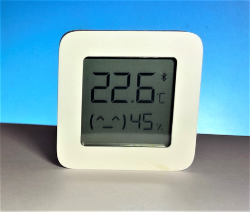
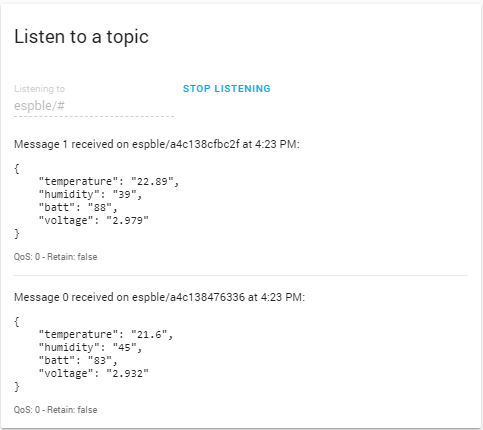
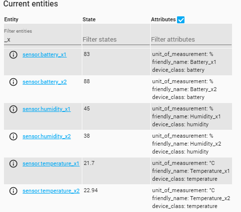
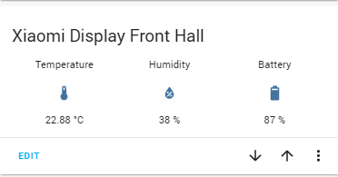

# Xiaomi_LYWSD03MMC_for_HA
Collecting data via Bluetooth from the Xiaomi LYWSD03MMC Temperature Display using ESP32 running Micropython

## Introduction
I have developed this project to integrate the Xiaomi LYWSD03MMC LCD temperature and Humidity display with Home Assistant.

<p align="center">
  
</p>

The display outputs Temperature, Humidity and Battery level using Bluetooth Low Energy (BLE). This means we need some sort of hub to collect the data and render it in a way that Home Assistant understands. I initially chose to use a Raspberry Pi W for this job as it has built-in support for BLE, but this repository uses a much cheaper ESP32. I have used an ESP32 dev board with a built-in usb serial interface and also an ESP32-CAM board with a separate USB to Serial converter. 

MQTT is an efficient way for remote devices to communicate with Home Assistant, so I added suport for this. At start up, the program will automatically find all the LYWSD03MMC devices on your network and will start publishing their data via MQTT
## Building The Solution

Download Micropython with BLE support from https://micropython.org/resources/firmware/esp32spiram-idf4-20191220-v1.12.bin

Install esptool using the instructions here https://github.com/espressif/esptool

Connect your ESP32 board to your serial port by the usb port on the board or an external serial to usb convertor.

If you are putting MicroPython on your board for the first time then you should first erase the entire flash using:

```esptool.py --chip esp32 --port /dev/ttyUSB0 erase_flash```

From then on program the firmware starting at address 0x1000:

```esptool.py --chip esp32 --port /dev/ttyUSB0 --baud 460800 write_flash -z 0x1000 esp32spiram-idf4-20191220-v1.12.bin```

Note - if you are using windows the port will be the com port that you ESP32 is connected to e.g.
```esptool.py --chip esp32 --port com3 erase_flash```

Using a terminal emulator program, such as putty, connect to the ESP32 board at 115200 BAUD.
You should see a screen like this.

<p align="center">
  
</p>

Now close the terminal emulator and install ampy using the instructions from Adafruit here https://learn.adafruit.com/micropython-basics-load-files-and-run-code/install-ampy

Now you need to download the files:
* ble.py
* mqtt.py
* main.py

In mqtt.py edit the following lines:
```
ssid = 'your_ssid'
password = 'your password'
mqtt_server = 'your_mqtt address'
```
so that the program can connect to your wifi and to your mqtt server

Now run  ```ampy -p com3 put ble.py```
and ```ampy-p com3 put mqtt.py```

Don't upload main.py yet and. of course, substitute the correct prot for your setup.

Reconnect your terminal emulator and reset the ESP32.
You should start to see an output like this. 
```
MicroPython v1.12 on 2019-12-20; ESP32 module (spiram) with ESP32
Type "help()" for more information.
>>> import mqtt
I (6680) modsocket: Initializing
I (15807) phy: phy_version: 4102, 2fa7a43, Jul 15 2019, 13:06:06, 0, 0
Connection successful
('192.168.0.62', '255.255.255.0', '192.168.0.1', '192.168.0.1')
Connected to 192.168.0.99 MQTT broker
Initialising
waiting to set BLE active
GAP procedure initiated: stop advertising.
start scan
GAP procedure initiated: discovery; own_addr_type=0 filter_policy=0 passive=1 limited=0 filter_duplicates=0 duration=60000ms
address type = 0, address = a4:c1:38:47:63:36
address type = 0, address = a4:c1:38:cf:bc:2f
address type = 0, address = a4:c1:38:47:63:36
address type = 0, address = a4:c1:38:47:63:36
address type = 0, address = a4:c1:38:47:63:36
address type = 0, address = a4:c1:38:47:63:36
address type = 0, address = a4:c1:38:cf:bc:2f
address type = 0, address = a4:c1:38:cf:bc:2f
```
The scan will time out and then you will see an entry like this for each LYWSD03MMC
```
--------------------------------------------
0 a4:c1:38:47:63:36
Trying to connect to a4:c1:38:47:63:36
GAP procedure initiated: connect; peer_addr_type=0 peer_addr=a4:c1:38:47:63:36 scan_itvl=16 scan_window=16 itvl_min=24 itvl_max=40 latency=0 supervision_timeout=256 min_ce_len=16 max_ce_len=768 own_addr_type=0
self.connected False
peripheral connect
GAP procedure initiated: connection parameter update; conn_handle=0 itvl_min=12 itvl_max=24 latency=0 supervision_timeout=90 min_ce_len=16 max_ce_len=768
Checking for connection before read
Reading Data
GATT procedure initiated: read; att_handle=3
.False
A gattc_read() has completed. 0 3 b'LYWSD03MMC\x00'
Char data b'LYWSD03MMC\x00'
Got LYWSD03MMC
GAP procedure initiated: terminate connection; conn_handle=0 hci_reason=19
.connected peripheral has disconnected. 0 0 a4:c1:38:47:63:36
```
Once all of the devices have been interrogated you will see a list like this

```
Found:
b'\xa4\xc18Gc6' LYWSD03MMC
b'\xa4\xc18\xcf\xbc/' LYWSD03MMC
(0, b'\xa4\xc18Gc6', 'LYWSD03MMC')
```

The program will then get readings from each device.
```
(0, b'\xa4\xc18Gc6', 'LYWSD03MMC')
Trying to connect to a4:c1:38:47:63:36
GAP procedure initiated: connect; peer_addr_type=0 peer_addr=a4:c1:38:47:63:36 scan_itvl=16 scan_window=16 itvl_min=24 itvl_max=40 latency=0 supervision_timeout=256 min_ce_len=16 max_ce_len=768 own_addr_type=0
self.connected False
peripheral connect
GAP procedure initiated: connection parameter update; conn_handle=0 itvl_min=12 itvl_max=24 latency=0 supervision_timeout=90 min_ce_len=16 max_ce_len=768
GATT procedure initiated: write; att_handle=56 len=2
.A gattc_write() has completed - status. 0 56 0
write ok
GATT procedure initiated: write; att_handle=70 len=3
.GAP procedure initiated: connection parameter update; conn_handle=0 itvl_min=400 itvl_max=400 latency=0 supervision_timeout=600 min_ce_len=16 max_ce_len=768
A gattc_write() has completed - status. 0 70 0
write ok
.A peripheral has sent a notify request. 0 54 b'g\x08-t\x0b'
Data received
67082d740b
GAP procedure initiated: terminate connection; conn_handle=0 hci_reason=19
.connected peripheral has disconnected. 0 0 a4:c1:38:47:63:36
{"temperature": "21.51", "humidity": "45", "batt": "83", "voltage": "2.932"}
b'espble/a4c138476336'
```
The ```espble/a4c138476336``` at the end is the topic used to publish this reading. All topics begin 'espble/' and the piece afterwards is the device address in hexadecimal.

You can now check that Home Assistant is receiving the data.

Go to *Developer Tools* and select *MQTT*
Under *Listen to a topic* enter the topic as *espble/#*
This will mena that HA is litening for any topic that starts with *espble/#*

You should see something like this. You may have to wait up to a minute to see readings.

<p align="center">
  
</p>

You now need to set up the sensors in configuration.yaml
For each sensor you will need an entry like this.
The ```sensor:```header must only occur once in you configuration.yaml
 
```
sensor:
  - platform: mqtt
    name: "Temperature_x1"
    state_topic: "espble/a4c138476336"
    unit_of_measurement: '°C'
    device_class: "temperature"
    value_template: "{{ value_json.temperature }}"
    
  - platform: mqtt
    name: "Humidity_x1"
    state_topic: "espble/a4c138476336"
    device_class: "humidity"
    unit_of_measurement: '%'
    value_template: "{{ value_json.humidity }}"
     
  - platform: mqtt
    name: "Battery_x1"
    state_topic: "espble/a4c138476336"
    device_class: "battery"
    unit_of_measurement: '%'
    value_template: "{{ value_json.batt }}"
```
Once you have finished editing, go to *Developer Tools* and select *Services*. Choose the *homeassitant.restart* service and click on *CALL SERVICE*.

Once HA has restarted go to *Developer Tools* and select *States*
Under *Current entities* *Filter entities* type *_x*
Assuming you have used my naming convention, you will see something like this.

<p align="center">
  
</p>

I have chosen to show the entities in a glance card

```
entities:
  - entity: sensor.temperature_x2
    name: Temperature
  - entity: sensor.humidity_x2
    name: Humidity
  - entity: sensor.battery_x2
    name: Battery
title: Xiaomi Display Front Hall
type: glance
```
<p align="center">
  
</p>

You can, of course now use these entities as you see fit.
The code allows the detection and saving of up to 20 devices.

Now you just have to use ampy to upload the main.py file and the program will start automatically after a reset. Remember, a reset will always initiate a scan, so, if you get a new device, just hit reset.
